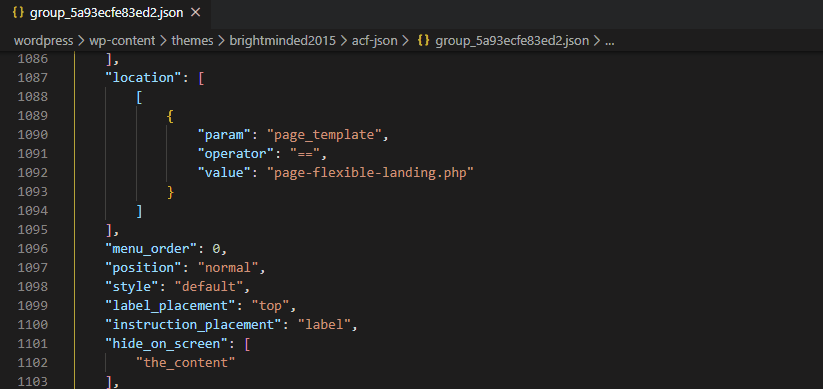

# Timestamper

Insert a current Unix timestamp.

## Features

This extension generates a current Unix timestamp and inserts it into your editor at the current cursor position. You can run the command with the keyboard shortcut (ctrl + shift + t) or by opening the command palette (ctrl + shift + p) and running "Insert timestamp".

Note that this extension is for generating a static timestamp at the time of running the command, rather than inserting a timestamp that will be current at the time of your codes execution. This is useful in situations where you need to update the "modified" timestamp in a JSON file.

## Known Issues

Calling out known issues can help limit users opening duplicate issues against your extension.

## Release Notes

Users appreciate release notes as you update your extension.

### 1.0.0

Initial release of Timestamper
